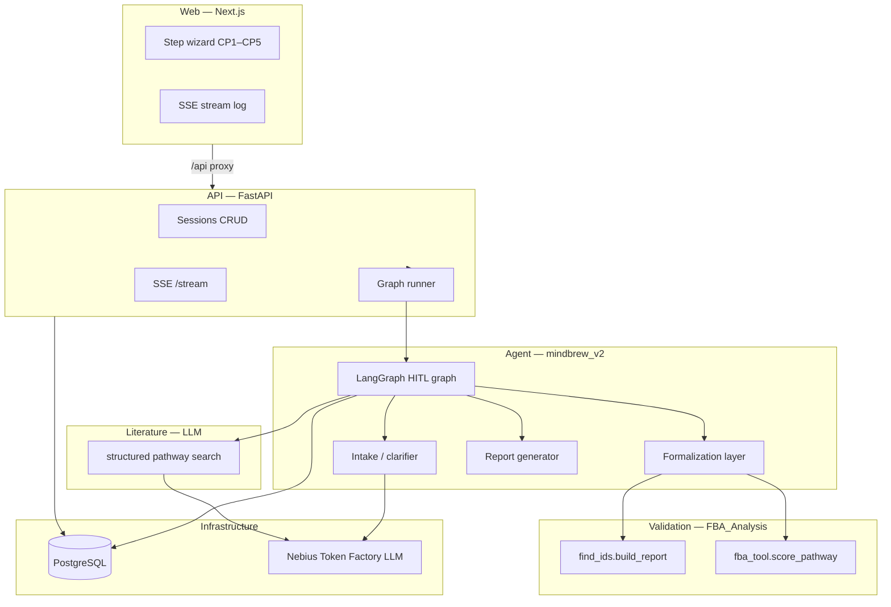
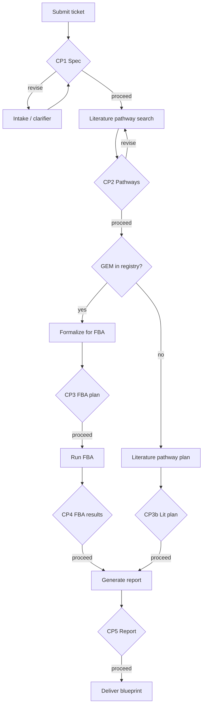

# Brewmind

**Computationally validated pathway blueprints for bioinformaticians.**

Brewmind takes plain-language R&D tickets (e.g. cosmetic/biocatalysis briefs), searches literature for pathway hypotheses, validates them against genome-scale metabolic models where available, and produces a **CRO-ready report** — what worked, what didn't, and why.

The product is **not** a literature summary. The moat is **flux-validated pathway design** before wet lab work.

---

## Table of contents

- [High-level architecture](#high-level-architecture)
- [Design choices](#design-choices)
- [Pipeline and human-in-the-loop](#pipeline-and-human-in-the-loop)
- [Repository structure](#repository-structure)
- [External engines](#external-engines)
- [Data and persistence](#data-and-persistence)
- [API surface](#api-surface)
- [Getting started](#getting-started)
- [Deployment](#deployment)
- [Configuration](#configuration)
- [Evaluation harness](#evaluation-harness)
- [Extending the system](#extending-the-system)
- [Version policy (v1 vs v2)](#version-policy-v1-vs-v2)
- [Troubleshooting](#troubleshooting)

---

## High-level architecture

Three specialized engines orchestrated by Brewmind v2, exposed through a web app:



| Layer | Technology | Role |
|-------|------------|------|
| **UI** | Next.js 14 (App Router) | Session list, step wizard, live stream, approve/revise per step |
| **API** | FastAPI + SSE | Sessions, graph execution, checkpoint resume |
| **Agent** | LangGraph + Pydantic | Phase graph, typed artifacts, HITL interrupts |
| **Literature** | Nebius LLM (structured extraction) | Pathway suggestions, papers, citations |
| **Validation** | [FBA_Analysis](https://github.com/yanglu12/FBA_Analysis) | COBRApy FBA via direct import; real GEM IDs, bottlenecks, calibration tiers |
| **LLM** | [Nebius Token Factory](https://docs.tokenfactory.nebius.com/) | OpenAI-compatible API for intake, parsing, literature search |
| **Store** | PostgreSQL | App sessions + LangGraph checkpoints |

---

## Design choices

### 1. Two engines, one orchestrator

- **Nebius LLM** handles literature pathway hypothesis generation via structured extraction.
- **FBA_Analysis** owns flux balance validation (COBRApy, imported directly from `vendor/FBA_Analysis/`).
- **Brewmind** owns intake, formalization (pathway biochemistry → FBA payloads), ranking interpretation, HITL gates, and report assembly.

LangGraph in v2 owns all phase transitions between literature search and FBA.

### 2. Human-in-the-loop at every major boundary

The agent **never autonomously advances** past a checkpoint. The bioinformatician reviews a summary artifact, then **Proceed**, **Revise**, or **Reject**. Revisions inject feedback into state and re-run from that step.

Checkpoints are implemented with LangGraph `interrupt_before` + `PostgresSaver` keyed by `session_id`.

### 3. GEM registry — not hardcoded models

`model_ref` is selected from `mindbrew_v2/config/gem_registry.yaml` based on organism, feedstock class, and product class. MVP ships **iYLI647** (*Y. lipolytica*) as the first enabled entry.

When **no GEM matches**, the pipeline does **not** stop — it switches to the **literature pathway branch** (CP3b → report).

### 4. Nebius as single LLM provider

All LLM calls go through Nebius Token Factory (OpenAI-compatible). Model selection is env-driven via `NEBIUS_MODEL` and optional `mindbrew_v2/config/models.yaml` per role (intake, parser).

### 5. v2 is a greenfield rewrite

`mindbrew_v1/` is frozen human reference only. **v2 must never import v1.**

### 6. Offline mode for dev and CI

Set `BREWMIND_OFFLINE=true` to run with deterministic fixtures — no Nebius or live FBA calls. FBA steps use in-process stubs in `fba_client.py` (not the vendor engine). Used by the eval harness and unit tests.

### 7. No Docker required for MVP

Connect to an **existing local Postgres** via `DATABASE_URL`. Docker Compose is optional for teammates later.

### 8. Same-origin API proxy

The Next.js app proxies `/api/*` → FastAPI to avoid CORS issues in local dev. Server-side rendering talks to the backend directly via `API_URL`.

---

## Pipeline and human-in-the-loop



| Step | Checkpoint | FBA branch | No-GEM branch |
|------|------------|------------|---------------|
| 1 | **CP1 — Spec** | Parsed `ResearchBrief` + validation mode badge | same |
| 2 | **CP2 — Pathways** | 3–7 pathway candidates; user selects | same |
| 3 | **CP3 / CP3b — Plan** | GEM, scenario, FAR/WS reactions with model metabolite IDs, knockouts | Enzymes, gene suggestions, citations, gaps |
| 4 | **CP4 — Results** | Ranked pass/fail, flux, bottlenecks | skipped |
| 5 | **CP5 — Report** | CRO-ready markdown with executive summary; PDF/DOCX export | same (literature tier labeled) |

**Mandatory FBA workflow** (when GEM matched):

```
select_gem(brief)                    → model_ref + scenario from registry
find_ids.build_report(model_ref)     → real metabolite/reaction IDs (never skip)
formalize_pathways(...)              → PathwayCandidate → ScorePathwayPayload
score_pathway(payload)               → flux, yield, bottlenecks, calibration
```

Formalization lives in [`mindbrew_v2/phases/formalize.py`](mindbrew_v2/phases/formalize.py) and [`mindbrew_v2/phases/fba_payloads.py`](mindbrew_v2/phases/fba_payloads.py). It maps literature pathway enzymes (e.g. FAR + WS for wax ester) onto model-resolved IDs from `find_ids` — e.g. `odecoa_c`, `EX_ocdcea_LPAREN_e_RPAREN_`, peroxisomal `ACOAO8p` knockouts. See [`vendor/FBA_Analysis/FBA_TOOL_CONTRACT.md`](vendor/FBA_Analysis/FBA_TOOL_CONTRACT.md).

---

## Repository structure

```
brewmind/
├── mindbrew_v2/              # Agent core
│   ├── config/
│   │   ├── llm.py            # Nebius client + structured extraction
│   │   ├── gem.py            # GemSelector
│   │   ├── gem_registry.yaml # Organism/feedstock → model_ref
│   │   └── models.yaml       # Per-role model overrides
│   ├── phases/
│   │   ├── intake.py         # Ticket → ResearchBrief
│   │   ├── literature_search.py  # Literature pathway search phase (LLM)
│   │   ├── gem_discovery.py  # Literature-driven GSMM discovery
│   │   ├── formalize.py      # PathwayCandidate → FBA payloads
│   │   ├── fba_payloads.py   # Wax-ester FAR/WS stoichiometry from find_ids IDs
│   │   ├── literature_plan.py
│   │   ├── report.py         # Outcome report generator
│   │   └── checkpoints.py    # HITL helpers
│   ├── tools/
│   │   ├── literature_client.py      # RAG literature pathway search
│   │   ├── literature_retrieval.py   # Retrieval orchestrator
│   │   ├── lamin_client.py           # Lamin/bionty ontologies + public datasets
│   │   ├── pubmed_search.py          # PubMed E-utilities search
│   │   ├── crossref_search.py        # Crossref works search
│   │   └── fba_client.py             # Direct import wrapper for find_ids + fba_tool
│   ├── graph.py              # LangGraph definition
│   ├── models.py             # Pydantic state models
│   ├── export/
│   │   └── report_export.py  # PDF / DOCX from report markdown
│   ├── offline/              # Deterministic fixtures (BREWMIND_OFFLINE)
│   └── eval/                 # Gold-truth harness
│       ├── gold/
│       │   ├── cases.yaml         # Offline regression cases (CI)
│       │   ├── live_cases.yaml    # Live LLM + gold-label benchmarks
│       │   └── sample_cases.yaml  # Reference samples (run_sample_cases only)
│       ├── fixtures/              # Briefs, pathways, payloads, expected gold
│       ├── annotations/           # Expert notes on acceptable variants
│       ├── scorers/               # Per-phase scorers + gold_assertions
│       ├── reports/               # Generated scorecards (.md + .json)
│       ├── schema.yaml            # Case fields + assertion types
│       ├── run_eval.py            # Main eval CLI → scorecard files
│       └── run_sample_cases.py    # Quick table output for sample cases
├── api/                      # FastAPI service
│   ├── main.py
│   ├── routes/sessions.py
│   ├── services/
│   │   ├── session_store.py
│   │   └── graph_runner.py
│   └── db/
│       ├── models.py         # SQLAlchemy: sessions, steps, stream_events
│       └── migrations/       # Alembic
├── web/                      # Next.js App Router
│   ├── app/
│   │   ├── page.tsx          # Session list
│   │   ├── sessions/new/     # New ticket
│   │   └── sessions/[id]/    # Step wizard
│   ├── components/           # StepSidebar, StreamLog, ArtifactView, ReviseDialog
│   └── lib/api.ts
├── vendor/FBA_Analysis/      # FBA engine from yanglu12/FBA_Analysis (git submodule)
├── scripts/                  # deploy-render.sh, run-migrations.sh, poc-smoke-test.sh, …
├── tests/
├── pyproject.toml
├── uv.lock
├── alembic.ini
└── .env.example
```

---

## External engines

### Literature search (RAG)

- Entry point: `search_pathways()` via [`mindbrew_v2/tools/literature_client.py`](mindbrew_v2/tools/literature_client.py)
- Flow: build queries from `ResearchBrief` → retrieve evidence → inject into LLM prompt → structured `PathwayCandidate[]`
- **Retrieval sources:**
  - [Lamin/bionty](https://docs.lamin.ai/introduction) — Pathway, Organism, Gene ontologies + public dataset metadata (`laminlabs/cellxgene`, etc.)
  - **PubMed** — NCBI E-utilities (`esearch` + abstract fetch)
  - **Crossref** — DOI works search for biochemistry papers
- Lamin indexes ontologies and omics datasets, **not** PubMed papers — both are used together for grounding
- Optional deps: `uv sync --extra literature` installs `bionty` + `lamindb` for Lamin; PubMed/Crossref work with core `httpx` only
- Set `LITERATURE_RETRIEVAL_ENABLED=false` to fall back to LLM-only (no retrieval calls)
- **GEM discovery** ([`gem_discovery.py`](mindbrew_v2/phases/gem_discovery.py)): after pathway search, additional retrieval queries identify GSMM names, biomass context, and SBML sources from literature when the static registry does not match

### FBA_Analysis (validation)

[FBA_Analysis](https://github.com/yanglu12/FBA_Analysis) is vendored under [`vendor/FBA_Analysis/`](vendor/FBA_Analysis/) and called via **direct Python import** (no separate conda env or subprocess).

| Component | Role |
|-----------|------|
| [`find_ids.py`](vendor/FBA_Analysis/find_ids.py) | `build_report(model_ref)` — SBML preflight + metabolite/reaction ID resolution |
| [`fba_tool.py`](vendor/FBA_Analysis/fba_tool.py) | `score_pathway(...)` — FBA scoring, bottlenecks, calibration |
| [`fba_client.py`](mindbrew_v2/tools/fba_client.py) | Brewmind wrapper; offline stubs when `BREWMIND_OFFLINE=true` |
| [`fba_payloads.py`](mindbrew_v2/phases/fba_payloads.py) | Builds `ScorePathwayPayload` from find_ids + pathway enzymes |

**Setup:**

```bash
git submodule update --init vendor/FBA_Analysis   # real code + iYLI647.xml
uv sync --extra fba                               # cobra, python-libsbml, optlang
```

**MVP model:** **iYLI647** (*Y. lipolytica*) with literature-calibrated scenarios under `vendor/FBA_Analysis/scenarios/`.

**Contract:** [`vendor/FBA_Analysis/FBA_TOOL_CONTRACT.md`](vendor/FBA_Analysis/FBA_TOOL_CONTRACT.md) — always run `build_report` before `score_pathway`; never invent metabolite IDs.

**Verify live ID resolution** (requires `--extra fba` and real vendor files):

```bash
uv run python -c "
import sys; sys.path.insert(0, 'vendor/FBA_Analysis')
from find_ids import build_report
r = build_report('vendor/FBA_Analysis/iYLI647.xml', [])
print(r['recommended']['carbon_source_rxn'])
"
# Expected: EX_ocdcea_LPAREN_e_RPAREN_  (not the offline stub EX_ole_e)
```

### Nebius Token Factory (LLM)

- Base URL: `https://api.tokenfactory.nebius.com/v1/`
- Used for: intake/clarifier, PathwayCandidate parser, literature search
- Get key: [tokenfactory.nebius.com](https://tokenfactory.nebius.com)

---

## Data and persistence

**One Postgres database, two uses:**

| Table / store | Purpose |
|---------------|---------|
| `sessions` | Session metadata (title, status, current step, validation mode) |
| `steps` | Per-checkpoint artifacts, revision history, human decisions |
| `stream_events` | SSE event log for replay |
| LangGraph `PostgresSaver` | Graph checkpoints (`thread_id` = `session_id`) |

Session lifecycle: `running` → `awaiting_user` (at each checkpoint) → `completed` or `failed`.

---

## API surface

| Method | Path | Description |
|--------|------|-------------|
| `GET` | `/health` | Health check |
| `GET` | `/sessions` | List sessions (newest first) |
| `POST` | `/sessions` | Create session `{ raw_brief, title? }`, starts graph |
| `GET` | `/sessions/{id}` | Full session + step records |
| `GET` | `/sessions/{id}/stream` | SSE — live events while step runs |
| `POST` | `/sessions/{id}/steps/{step_id}/decide` | `{ action, notes?, selected_pathway_ids? }` |
| `POST` | `/sessions/{id}/steps/{step_id}/restart` | Re-run the current step; prior-step artifacts are kept |
| `POST` | `/sessions/{id}/interrupt` | Stop a **running** agent (between checkpoints) |
| `POST` | `/sessions/{id}/resume` | Continue from last checkpoint after interrupt |
| `GET` | `/sessions/{id}/report/export?format=pdf\|docx` | Download CRO report as PDF or Word |
| `DELETE` | `/sessions/{id}` | Delete session |

**SSE event types:** `step_start`, `step_complete`, `awaiting_user`, `interrupted`, `log`, `heartbeat`, `node_start`, `node_end`, `tool_start`, `tool_end`, `llm_call`, `error`

While the agent is **running** (between checkpoints), use **Stop agent** in the UI or `POST /sessions/{id}/interrupt`. Status becomes `interrupted`; click **Resume** or `POST /sessions/{id}/resume` to continue from the last LangGraph checkpoint. Interruption takes effect after the current graph node finishes (not mid-LLM-call).

At any checkpoint (or after a failed/interrupted step), use **Restart step** or `POST /sessions/{id}/steps/{step_id}/restart` to re-run that step from scratch while keeping results from earlier steps (brief, pathways, etc.). **Retry** on failed sessions uses the same behavior when step artifacts exist.

---

## Getting started

### Prerequisites

- Python 3.11+
- [uv](https://docs.astral.sh/uv/) (recommended) or pip + venv
- Node.js 18+ (for web UI)
- PostgreSQL (local instance — no Docker required)
- Nebius API key (optional if using offline mode)
- FBA optional extra (`uv sync --extra fba`) for live flux validation — not needed when `BREWMIND_OFFLINE=true`

### Install and run

```bash
cp .env.example .env
# Edit DATABASE_URL, NEBIUS_API_KEY, etc.

uv sync --extra dev --extra fba
git submodule update --init vendor/FBA_Analysis

createdb brewmind          # if the database doesn't exist
uv run alembic upgrade head

# Terminal 1 — API
uv run uvicorn api.main:app --reload --port 8000

# Terminal 2 — Web UI
cd web && npm install && npm run dev
```

Open [http://localhost:3000](http://localhost:3000) → **New session** → paste your R&D brief.

At **CP5 — Report**, use **Download PDF** or **Download Word** in the UI (or `GET /sessions/{id}/report/export?format=pdf`).

### Using uv

```bash
uv sync --extra dev --extra fba   # dev tools + FBA (cobra) for live validation
uv sync --extra dev               # sufficient for offline mode / CI
uv run <command>                  # run without activating venv
source .venv/bin/activate         # optional: activate venv
```

Optional dependency groups:

| Extra | Installs | When needed |
|-------|----------|-------------|
| `dev` | pytest, ruff | Tests and linting |
| `fba` | cobra, python-libsbml, optlang | Live FBA scoring (CP3–CP4) |
| `literature` | bionty, lamindb | Lamin ontology/dataset retrieval |
| `observability` | OpenTelemetry SDK + FastAPI instrumentation | Optional OTLP export |

### Alternative: pip

```bash
python -m venv .venv && source .venv/bin/activate
pip install -e ".[dev,fba]"
```

---

## Deployment

Production uses a **hybrid stack** (no monolithic Docker Compose required):

| Component | Platform | Notes |
|-----------|----------|-------|
| **Postgres** | Supabase | Use **Session pooler** URI (IPv4), not Direct connection |
| **API** | Render | `render.yaml` Blueprint — FastAPI + LangGraph |
| **Web** | Vercel | Root directory `web/`; proxies browser calls to Render API |

**One-time setup:**

```bash
# 1. Create Supabase project → copy Session pooler DATABASE_URL
# 2. Run migrations (separate from app start — not on uvicorn boot)
DATABASE_URL='postgresql://…' ./scripts/run-migrations.sh

# 3. Deploy API (Render Dashboard → Blueprint from repo, or):
./scripts/deploy-render.sh    # prints step-by-step checklist

# 4. Deploy web (Vercel):
./scripts/deploy-vercel.sh    # set API_URL + NEXT_PUBLIC_API_URL to Render URL
```

Set on Render `brewmind-api`: `DATABASE_URL`, `NEBIUS_*`, `CORS_ORIGINS` (your Vercel origin). Set on Vercel: `API_URL` and `NEXT_PUBLIC_API_URL` to the Render API base (e.g. `https://brewmind-api.onrender.com`).

Smoke test after deploy: `./scripts/poc-smoke-test.sh`.

---

## Configuration

Copy `.env.example` → `.env`. All variables below are **required** for the Python backend (`mindbrew_v2/settings.py` fails fast if any are missing):

| Variable | Description |
|----------|-------------|
| `DATABASE_URL` | Postgres connection string. Use `postgresql+psycopg://…` (psycopg v3). Plain `postgresql://` is auto-normalized. |
| `NEBIUS_API_KEY` | Nebius Token Factory API key |
| `NEBIUS_MODEL` | LLM model (e.g. `deepseek-ai/DeepSeek-V4-Pro`) |
| `NEBIUS_BASE_URL` | Nebius API base URL (e.g. `https://api.tokenfactory.nebius.com/v1/`) |
| `BREWMIND_OFFLINE` | `true` = fixtures only, no external API calls |
| `GEM_MODEL_CACHE_DIR` | Local cache for downloaded SBML models (default `data/gem_models`) |
| `MAX_REVISIONS` | Max human revision cycles per session |
| `PROGRESS_HEARTBEAT_INTERVAL_SEC` | SSE heartbeat interval during long steps (default `15`) |
| `LITERATURE_RETRIEVAL_ENABLED` | `true` = RAG retrieval before LLM pathway extraction (default) |
| `LAMIN_PUBLIC_DBS` | Comma-separated public Lamin DBs (default `laminlabs/cellxgene`) |
| `LITERATURE_MAX_ONTOLOGY_HITS` | Max bionty ontology hits per query (default `5`) |
| `LITERATURE_MAX_ARTIFACT_HITS` | Max Lamin artifact hits per DB (default `5`) |
| `LITERATURE_MAX_PUBMED_HITS` | Max PubMed papers per query (default `8`) |
| `LITERATURE_MAX_CROSSREF_HITS` | Max Crossref works per query (default `5`) |
| `LITERATURE_CONTEXT_MAX_CHARS` | Max chars of retrieved context in LLM prompt (default `8000`) |
| `API_URL` | Backend URL for Next.js SSR (default `http://127.0.0.1:8000`) |
| `NEXT_PUBLIC_API_URL` | Browser API base (default `/api` — proxied, avoids CORS) |
| `CORS_ORIGINS` | Optional comma-separated extra CORS origins for direct API access |
| `LANGSMITH_API_KEY` | Optional — trace LLM / LangGraph runs |
| `LANGSMITH_PROJECT` | LangSmith project name (default `brewmind`) |
| `OTEL_EXPORTER_OTLP_ENDPOINT` | Optional — OpenTelemetry export (requires `--extra observability`) |

---

## Evaluation harness

Regression and quality benchmarks for each pipeline phase. Cases are YAML with machine-checkable **assertions**; live-tier cases also compare against expert-reviewed **gold fixtures**.

### Layout

```
mindbrew_v2/eval/
├── gold/
│   ├── cases.yaml          # Offline cases — loaded by run_eval (CI regression)
│   ├── live_cases.yaml     # Live cases — require Nebius + --live
│   └── sample_cases.yaml   # Reference / draft cases — run_sample_cases only
├── fixtures/
│   ├── briefs/             # Frozen ResearchBrief JSON for fixture-driven cases
│   ├── pathways/           # Frozen PathwayCandidate lists
│   ├── payloads/           # ScorePathwayPayload for FBA-only cases
│   └── expected/{case_id}/ # Gold labels (brief.json, pathways.json, …)
├── annotations/{case_id}.md  # Acceptable variants for reviewers
├── scorers/                # intake, pathways, formalize, fba, e2e
├── schema.yaml             # Field docs + assertion type reference
├── run_eval.py             # Main harness → scorecard .md + .json
└── run_sample_cases.py     # Quick pass/fail table (especially for samples)
```

### Phases and tiers

| Phase | What it scores |
|-------|----------------|
| `intake` | Raw brief → `ResearchBrief` (gatekeeper, fields) |
| `pathways` | Literature search → pathway candidates + citations |
| `formalize` | Brief + candidates → FBA payloads (or skip when unmapped) |
| `fba` | `score_pathway` on fixture payloads |
| `e2e` | Full pipeline through report sections |

| Tier | Case file | `BREWMIND_OFFLINE` | When to use |
|------|-----------|-------------------|-------------|
| **offline** | `gold/cases.yaml` | `true` (forced) | CI, fast local regression |
| **live** | `gold/live_cases.yaml` | `false` | Quality benchmark vs gold fixtures |
| **sample** | `gold/sample_cases.yaml` | either | Iterating on new cases before promoting |

### `run_eval` — main harness

Writes timestamped scorecards to `mindbrew_v2/eval/reports/` (`scorecard_{tier}_{stamp}.md` and `.json`).

```bash
# Offline regression (CI-friendly — no API key needed)
uv run python -m mindbrew_v2.eval.run_eval --tier offline

# Single phase
uv run python -m mindbrew_v2.eval.run_eval --tier offline --phase intake
uv run python -m mindbrew_v2.eval.run_eval --tier offline --phase e2e

# Live quality benchmark (NEBIUS_API_KEY in .env, uv sync --extra fba recommended)
uv run python -m mindbrew_v2.eval.run_eval --tier live --live

# Offline pass, then live pass in one invocation
uv run python -m mindbrew_v2.eval.run_eval --tier all --live
```

**Flags:**

| Flag | Description |
|------|-------------|
| `--tier offline\|live\|all` | Which case files to load (default `offline`) |
| `--live` | Required when `--tier live` or `--tier all`; runs `requires_live_api: true` cases |
| `--phase PHASE` | Run only `intake`, `pathways`, `formalize`, `fba`, or `e2e` |

`run_eval` sets `BREWMIND_OFFLINE` automatically per tier. You do not need to prefix commands with `BREWMIND_OFFLINE=…`.

### `run_sample_cases` — quick table output

Uses `gold/sample_cases.yaml` only (not loaded by `run_eval`). Prints a pass/fail table to stdout; exit code `1` if any case failed.

```bash
# All offline sample cases (fast, no API key)
uv run python -m mindbrew_v2.eval.run_sample_cases

# Verbose progress per case
uv run python -m mindbrew_v2.eval.run_sample_cases -v

# Live Nebius LLM (requires NEBIUS_API_KEY in .env)
uv run python -m mindbrew_v2.eval.run_sample_cases --live

# Filter by phase or case id
uv run python -m mindbrew_v2.eval.run_sample_cases --live --phase intake
uv run python -m mindbrew_v2.eval.run_sample_cases --live --case sample_silicone_e2e_fba_v1
uv run python -m mindbrew_v2.eval.run_sample_cases --case sample_reject_intake_v1
```

Live-tier sample cases (e.g. `sample_live_wax_ester_client_v1`) are **skipped** unless you pass `--live`.

### pytest integration

```bash
uv run pytest tests/test_eval_harness.py -v   # offline eval must pass; fixture structure checks
uv run pytest tests/                          # full unit + golden-path suite
```

`test_offline_eval_passes` runs all offline cases via `run_eval(tier="offline")` — keep `gold/cases.yaml` green before merging.

### Adding and promoting cases

1. **Draft** — copy a block from `sample_cases.yaml` or an existing case; iterate with `run_sample_cases`.
2. **Offline regression** — append to `gold/cases.yaml` with `requires_live_api: false`.
3. **Live benchmark** — run a real session (`BREWMIND_OFFLINE=false`), approve CP1/CP2 artifacts, save JSON under `fixtures/expected/{case_id}/`, add case to `live_cases.yaml` with `gold.brief_ref` / `gold.pathways_ref`.
4. **Document variants** — add `annotations/{case_id}.md` (acceptable enzyme names, verdict ranges, etc.).
5. **Validate** — `uv run python -m mindbrew_v2.eval.run_eval --tier live --live`.

Assertion types (`field_contains`, `gold_brief_fields`, `fba_full_pipeline`, `report_has_sections`, …) are documented in [`mindbrew_v2/eval/schema.yaml`](mindbrew_v2/eval/schema.yaml).

Live templates in `live_cases.yaml` (`live_wax_ester_template_v1`, `live_microbiome_template_v1`, `live_ambiguous_template_v1`) include starter gold fixtures — replace after reviewing a real session (see matching files in `eval/annotations/`).

---

## Extending the system

### Add a new GEM

1. Add model + scenarios under `vendor/FBA_Analysis/`
2. Register in `mindbrew_v2/config/gem_registry.yaml` with organism aliases, product/feedstock classes, scenario pointers
3. Set `enabled: true`

### Add a new feedstock scenario

Add a scenario YAML under `vendor/FBA_Analysis/scenarios/` and reference it in the GEM's `scenarios.by_feedstock` in the registry.

### Add eval cases

See [Evaluation harness](#evaluation-harness) for the full workflow. Short version: draft in `sample_cases.yaml` → promote to `cases.yaml` or `live_cases.yaml` → add fixtures under `eval/fixtures/` → optional `annotations/{case_id}.md` → validate with `run_eval` or `run_sample_cases`.

### Update FBA_Analysis vendor

The upstream repo is tracked as a git submodule. To pull latest:

```bash
git submodule update --remote vendor/FBA_Analysis
uv sync --extra fba
uv run pytest tests/test_formalize.py -v   # integration test checks real ID resolution
```

---

## Version policy (v1 vs v2)

| | `mindbrew_v1/` | `mindbrew_v2/` |
|---|----------------|----------------|
| Status | Frozen prototype | Active development |
| Imports | Never imported by v2 | Standalone package |
| Scope | Early intake sketch | Full pipeline: literature → FBA → blueprint |

**Hard rule:** no `from mindbrew_v1 import …` anywhere in v2, api, or web.

---

## Troubleshooting

| Issue | Fix |
|-------|-----|
| `ModuleNotFoundError: psycopg2` | Project uses **psycopg v3**. Use `postgresql+psycopg://…` in `DATABASE_URL`, or let the API auto-normalize bare `postgresql://`. Run `uv sync --extra dev`. |
| `OPTIONS /sessions` 400 | CORS preflight failed. Set `NEXT_PUBLIC_API_URL=/api` in `.env` and restart Next.js so the browser uses the same-origin proxy. |
| Session stuck on "running" | Check API logs; ensure Postgres is reachable and `DATABASE_URL` is correct. |
| Stream log appears frozen during literature search | Long steps emit heartbeats every `PROGRESS_HEARTBEAT_INTERVAL_SEC` (default 15s). LLM and retrieval substeps log progress lines — wait for the stale-activity banner or check API logs. |
| No LLM responses | Verify `NEBIUS_API_KEY`. For local dev without keys, set `BREWMIND_OFFLINE=true`. |
| CP3 FBA plan shows stub IDs (`EX_ole_e`, `FAR_rxn`) | Run `git submodule update --init vendor/FBA_Analysis` and confirm `vendor/FBA_Analysis/iYLI647.xml` is ~2 MB SBML (not a text placeholder). Install FBA deps: `uv sync --extra fba`. Set `BREWMIND_OFFLINE=false`. |
| `ImportError: cobra` or FBA falls back to offline stub | Run `uv sync --extra fba`. Restart the API after installing. |
| `vendor/FBA_Analysis contains offline stubs` in logs | Submodule not initialized — run `git submodule update --init vendor/FBA_Analysis`. |
