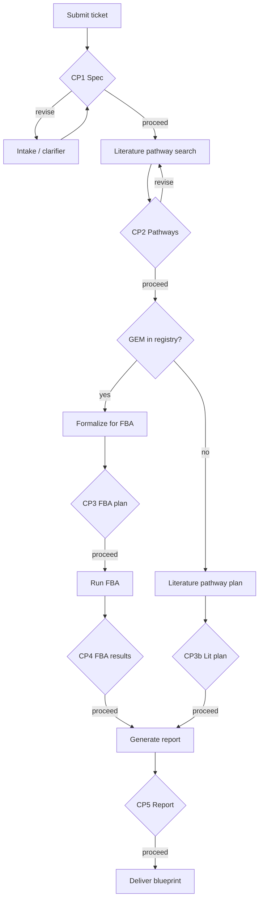

# Brewmind

**Computationally validated pathway blueprints for bioinformaticians.**

Brewmind takes plain-language R&D tickets (e.g. cosmetic/biocatalysis briefs), searches literature for pathway hypotheses, validates them against genome-scale metabolic models where available, and produces a **CRO-ready report** — what worked, what didn't, and why.

The product is **not** a literature summary. The moat is **flux-validated pathway design** before wet lab work.

---

## Table of contents

- [High-level architecture](#high-level-architecture)
- [Design choices](#design-choices)
- [Pipeline and human-in-the-loop](#pipeline-and-human-in-the-loop)
- [Repository structure](#repository-structure)
- [External engines](#external-engines)
- [Data and persistence](#data-and-persistence)
- [API surface](#api-surface)
- [Getting started](#getting-started)
- [Configuration](#configuration)
- [Demo tickets](#demo-tickets)
- [Evaluation harness](#evaluation-harness)
- [Extending the system](#extending-the-system)
- [Version policy (v1 vs v2)](#version-policy-v1-vs-v2)

---

## High-level architecture

Three specialized engines orchestrated by Brewmind v2, exposed through a web app:

```mermaid
flowchart TB
    subgraph ui [Web — Next.js]
        wizard[Step wizard CP1–CP5]
        stream[SSE stream log]
    end

    subgraph api [API — FastAPI]
        sessions[Sessions CRUD]
        runner[Graph runner]
        sse[SSE /stream]
    end

    subgraph agent [Agent — mindbrew_v2]
        graph[LangGraph HITL graph]
        intake[Intake / clarifier]
        formalize[Formalization layer]
        report[Report generator]
    end

    subgraph lit [Literature — LLM]
        litsearch[structured pathway search]
    end

    subgraph fba [Validation — FBA_Analysis]
        findids[find_ids.py]
        score[score_pathway]
    end

    subgraph infra [Infrastructure]
        pg[(PostgreSQL)]
        nebius[Nebius Token Factory LLM]
    end

    ui -->|"/api proxy"| api
    api --> runner
    runner --> graph
    graph --> intake
    graph --> litsearch
    graph --> formalize
    formalize --> findids
    formalize --> score
    graph --> report
    intake --> nebius
    litsearch --> nebius
    api --> pg
    graph --> pg
```

| Layer | Technology | Role |
|-------|------------|------|
| **UI** | Next.js 14 (App Router) | Session list, step wizard, live stream, approve/revise per step |
| **API** | FastAPI + SSE | Sessions, graph execution, checkpoint resume |
| **Agent** | LangGraph + Pydantic | Phase graph, typed artifacts, HITL interrupts |
| **Literature** | Nebius LLM (structured extraction) | Pathway suggestions, papers, citations |
| **Validation** | [FBA_Analysis](https://github.com/yanglu12/FBA_Analysis) | `score_pathway()` on GEM; bottlenecks, calibration tiers |
| **LLM** | [Nebius Token Factory](https://docs.tokenfactory.nebius.com/) | OpenAI-compatible API for intake, parsing, literature search |
| **Store** | PostgreSQL | App sessions + LangGraph checkpoints |

---

## Design choices

### 1. Two engines, one orchestrator

- **Nebius LLM** handles literature pathway hypothesis generation via structured extraction.
- **FBA_Analysis** owns flux balance validation.
- **Brewmind** owns intake, formalization (pathway biochemistry → FBA payloads), ranking interpretation, HITL gates, and report assembly.

LangGraph in v2 owns all phase transitions between literature search and FBA.

### 2. Human-in-the-loop at every major boundary

The agent **never autonomously advances** past a checkpoint. The bioinformatician reviews a summary artifact, then **Proceed**, **Revise**, or **Reject**. Revisions inject feedback into state and re-run from that step.

Checkpoints are implemented with LangGraph `interrupt_before` + `PostgresSaver` keyed by `session_id`.

### 3. GEM registry — not hardcoded models

`model_ref` is selected from `mindbrew_v2/config/gem_registry.yaml` based on organism, feedstock class, and product class. MVP ships **iYLI647** (*Y. lipolytica*) as the first enabled entry.

When **no GEM matches**, the pipeline does **not** stop — it switches to the **literature pathway branch** (CP3b → report).

### 4. Nebius as single LLM provider

All LLM calls go through Nebius Token Factory (OpenAI-compatible). Model selection is env-driven via `NEBIUS_MODEL` and optional `mindbrew_v2/config/models.yaml` per role (intake, parser).

### 5. v2 is a greenfield rewrite

`mindbrew_v1/` is frozen human reference only. **v2 must never import v1.**

### 6. Offline mode for dev and CI

Set `BREWMIND_OFFLINE=true` to run with deterministic fixtures — no Nebius or live FBA calls. Used by the eval harness and unit tests.

### 7. No Docker required for MVP

Connect to an **existing local Postgres** via `DATABASE_URL`. Docker Compose is optional for teammates later.

### 8. Same-origin API proxy

The Next.js app proxies `/api/*` → FastAPI to avoid CORS issues in local dev. Server-side rendering talks to the backend directly via `API_URL`.

---

## Pipeline and human-in-the-loop



| Step | Checkpoint | FBA branch | No-GEM branch |
|------|------------|------------|---------------|
| 1 | **CP1 — Spec** | Parsed `ResearchBrief` + validation mode badge | same |
| 2 | **CP2 — Pathways** | 3–7 pathway candidates; user selects | same |
| 3 | **CP3 / CP3b — Plan** | GEM, scenario, reactions, knockouts | Enzymes, gene suggestions, citations, gaps |
| 4 | **CP4 — Results** | Ranked pass/fail, flux, bottlenecks | skipped |
| 5 | **CP5 — Report** | CRO-ready markdown: worked / didn't / recommendations | same (literature tier labeled) |

**Mandatory FBA workflow** (when GEM matched):

```
select_gem(brief)           → model_ref from registry
find_ids.py {model_ref}     → metabolite/reaction IDs (never skip)
score_pathway(...)          → calibration + bottlenecks
```

---

## Repository structure

```
brewmind/
├── mindbrew_v1/              # FROZEN prototype — reference only, never imported
├── mindbrew_v2/              # Agent core
│   ├── config/
│   │   ├── llm.py            # Nebius client + structured extraction
│   │   ├── gem.py            # GemSelector
│   │   ├── gem_registry.yaml # Organism/feedstock → model_ref
│   │   └── models.yaml       # Per-role model overrides
│   ├── phases/
│   │   ├── intake.py         # Ticket → ResearchBrief
│   │   ├── biomni.py         # Literature search phase (LLM)
│   │   ├── formalize.py      # PathwayCandidate → FBA payloads
│   │   ├── literature_plan.py
│   │   ├── report.py         # Outcome report generator
│   │   └── checkpoints.py    # HITL helpers
│   ├── tools/
│   │   ├── literature_client.py      # RAG literature pathway search
│   │   ├── literature_retrieval.py   # Retrieval orchestrator
│   │   ├── lamin_client.py           # Lamin/bionty ontologies + public datasets
│   │   ├── pubmed_search.py          # PubMed E-utilities search
│   │   ├── crossref_search.py        # Crossref works search
│   │   └── fba_client.py             # find_ids + score_pathway wrapper
│   ├── graph.py              # LangGraph definition
│   ├── models.py             # Pydantic state models
│   ├── demo_tickets.py       # Ticket 1–3 demo briefs
│   ├── offline/              # Deterministic fixtures (BREWMIND_OFFLINE)
│   └── eval/                 # Gold-truth harness
│       ├── gold/cases.yaml
│       ├── scorers/
│       └── run_eval.py
├── api/                      # FastAPI service
│   ├── main.py
│   ├── routes/sessions.py
│   ├── services/
│   │   ├── session_store.py
│   │   └── graph_runner.py
│   └── db/
│       ├── models.py         # SQLAlchemy: sessions, steps, stream_events
│       └── migrations/       # Alembic
├── web/                      # Next.js App Router
│   ├── app/
│   │   ├── page.tsx          # Session list
│   │   ├── sessions/new/     # New ticket
│   │   └── sessions/[id]/    # Step wizard
│   ├── components/           # StepSidebar, StreamLog, ArtifactView, ReviseDialog
│   └── lib/api.ts
├── vendor/FBA_Analysis/      # FBA engine (git submodule; offline stubs included)
├── tests/
├── pyproject.toml
├── uv.lock
├── alembic.ini
└── .env.example
```

---

## External engines

### Literature search (RAG)

- Entry point: `search_pathways()` via [`mindbrew_v2/tools/literature_client.py`](mindbrew_v2/tools/literature_client.py)
- Flow: build queries from `ResearchBrief` → retrieve evidence → inject into LLM prompt → structured `PathwayCandidate[]`
- **Retrieval sources:**
  - [Lamin/bionty](https://docs.lamin.ai/introduction) — Pathway, Organism, Gene ontologies + public dataset metadata (`laminlabs/cellxgene`, etc.)
  - **PubMed** — NCBI E-utilities (`esearch` + abstract fetch)
  - **Crossref** — DOI works search for biochemistry papers
- Lamin indexes ontologies and omics datasets, **not** PubMed papers — both are used together for grounding
- Optional deps: `uv sync --extra literature` installs `bionty` + `lamindb` for Lamin; PubMed/Crossref work with core `httpx` only
- Set `LITERATURE_RETRIEVAL_ENABLED=false` to fall back to LLM-only (no retrieval calls)

### FBA_Analysis (validation)

- Entry point: `score_pathway()` in `vendor/FBA_Analysis/fba_tool.py`
- Preflight: `find_ids.py {model_ref} --json` — **always run before scoring**
- MVP model: **iYLI647** (*Y. lipolytica*)
- Contract: see `vendor/FBA_Analysis/FBA_TOOL_CONTRACT.md`
- Init submodule: `git submodule update --init vendor/FBA_Analysis`

### Nebius Token Factory (LLM)

- Base URL: `https://api.tokenfactory.nebius.com/v1/`
- Used for: intake/clarifier, PathwayCandidate parser, literature search
- Get key: [tokenfactory.nebius.com](https://tokenfactory.nebius.com)

---

## Data and persistence

**One Postgres database, two uses:**

| Table / store | Purpose |
|---------------|---------|
| `sessions` | Session metadata (title, status, current step, validation mode) |
| `steps` | Per-checkpoint artifacts, revision history, human decisions |
| `stream_events` | SSE event log for replay |
| LangGraph `PostgresSaver` | Graph checkpoints (`thread_id` = `session_id`) |

Session lifecycle: `running` → `awaiting_user` (at each checkpoint) → `completed` or `failed`.

---

## API surface

| Method | Path | Description |
|--------|------|-------------|
| `GET` | `/health` | Health check |
| `GET` | `/sessions` | List sessions (newest first) |
| `POST` | `/sessions` | Create session `{ raw_brief, title? }`, starts graph |
| `GET` | `/sessions/{id}` | Full session + step records |
| `GET` | `/sessions/{id}/stream` | SSE — live events while step runs |
| `POST` | `/sessions/{id}/steps/{step_id}/decide` | `{ action, notes?, selected_pathway_ids? }` |
| `POST` | `/sessions/{id}/steps/{step_id}/restart` | Re-run the current step; prior-step artifacts are kept |
| `POST` | `/sessions/{id}/interrupt` | Stop a **running** agent (between checkpoints) |
| `POST` | `/sessions/{id}/resume` | Continue from last checkpoint after interrupt |
| `DELETE` | `/sessions/{id}` | Delete session |

**SSE event types:** `step_start`, `step_complete`, `awaiting_user`, `interrupted`, `token`, `tool_start`, `tool_end`, `error`

While the agent is **running** (between checkpoints), use **Stop agent** in the UI or `POST /sessions/{id}/interrupt`. Status becomes `interrupted`; click **Resume** or `POST /sessions/{id}/resume` to continue from the last LangGraph checkpoint. Interruption takes effect after the current graph node finishes (not mid-LLM-call).

At any checkpoint (or after a failed/interrupted step), use **Restart step** or `POST /sessions/{id}/steps/{step_id}/restart` to re-run that step from scratch while keeping results from earlier steps (brief, pathways, etc.). **Retry** on failed sessions uses the same behavior when step artifacts exist.

---

## Getting started

### Prerequisites

- Python 3.11+
- [uv](https://docs.astral.sh/uv/) (recommended) or pip + venv
- Node.js 18+ (for web UI)
- PostgreSQL (local instance — no Docker required)
- Nebius API key (optional if using offline mode)

### Install and run

```bash
cp .env.example .env
# Edit DATABASE_URL, NEBIUS_API_KEY, etc.

uv sync --extra dev

createdb brewmind          # if the database doesn't exist
uv run alembic upgrade head

# Terminal 1 — API
uv run uvicorn api.main:app --reload --port 8000

# Terminal 2 — Web UI
cd web && npm install && npm run dev
```

Open [http://localhost:3000](http://localhost:3000) → **New session** → paste a brief or pick a demo ticket.

### Using uv

```bash
uv sync --extra dev          # install deps into .venv from uv.lock
uv run <command>             # run without activating venv
source .venv/bin/activate    # optional: activate venv
```

### Alternative: pip

```bash
python -m venv .venv && source .venv/bin/activate
pip install -e ".[dev]"
```

---

## Configuration

Copy `.env.example` → `.env`. All variables below are **required** for the Python backend (`mindbrew_v2/settings.py` fails fast if any are missing):

| Variable | Description |
|----------|-------------|
| `DATABASE_URL` | Postgres connection string. Use `postgresql+psycopg://…` (psycopg v3). Plain `postgresql://` is auto-normalized. |
| `NEBIUS_API_KEY` | Nebius Token Factory API key |
| `NEBIUS_MODEL` | LLM model (e.g. `deepseek-ai/DeepSeek-V4-Pro`) |
| `NEBIUS_BASE_URL` | Nebius API base URL (e.g. `https://api.tokenfactory.nebius.com/v1/`) |
| `BREWMIND_OFFLINE` | `true` = fixtures only, no external API calls |
| `FBA_PYTHON` | Python executable for FBA subprocess |
| `MAX_REVISIONS` | Max human revision cycles per session |
| `LITERATURE_RETRIEVAL_ENABLED` | `true` = RAG retrieval before LLM pathway extraction (default) |
| `LAMIN_PUBLIC_DBS` | Comma-separated public Lamin DBs (default `laminlabs/cellxgene`) |
| `LITERATURE_MAX_ONTOLOGY_HITS` | Max bionty ontology hits per query (default `5`) |
| `LITERATURE_MAX_ARTIFACT_HITS` | Max Lamin artifact hits per DB (default `5`) |
| `LITERATURE_MAX_PUBMED_HITS` | Max PubMed papers per query (default `8`) |
| `LITERATURE_MAX_CROSSREF_HITS` | Max Crossref works per query (default `5`) |
| `LITERATURE_CONTEXT_MAX_CHARS` | Max chars of retrieved context in LLM prompt (default `8000`) |
| `API_URL` | Backend URL for Next.js SSR (default `http://127.0.0.1:8000`) |
| `NEXT_PUBLIC_API_URL` | Browser API base (default `/api` — proxied, avoids CORS) |
| `CORS_ORIGINS` | Optional comma-separated extra CORS origins for direct API access |

---

## Demo tickets

Three Estée Lauder-style briefs ship with the UI and eval harness:

| Ticket | Topic | Typical branch |
|--------|-------|----------------|
| **Ticket 1** | Silicone replacement via plant-oil fermentation | FBA (iYLI647) — golden path |
| **Ticket 2** | Scalp microbiome / dandruff ingredient | Literature (no GEM yet) |
| **Ticket 3** | Cuticle repair / barrier lipid from plant oil | FBA if lipid GEM matches; else literature |

Defined in `mindbrew_v2/demo_tickets.py` and selectable on the **New session** page.

---

## Evaluation harness

Gold-truth cases in YAML — extend by appending to `mindbrew_v2/eval/gold/cases.yaml`:

```bash
# Offline (no API keys — CI-friendly)
BREWMIND_OFFLINE=true uv run python -m mindbrew_v2.eval.run_eval

# Single phase
BREWMIND_OFFLINE=true uv run python -m mindbrew_v2.eval.run_eval --phase intake

# Live (requires Nebius)
uv run python -m mindbrew_v2.eval.run_eval --live
```

Scorecards are written to `mindbrew_v2/eval/reports/`.

```bash
uv run pytest tests/    # unit + golden-path tests
```

---

## Extending the system

### Add a new GEM

1. Add model + scenarios under `vendor/FBA_Analysis/`
2. Register in `mindbrew_v2/config/gem_registry.yaml` with organism aliases, product/feedstock classes, scenario pointers
3. Set `enabled: true`

### Add a new feedstock scenario

Add a scenario YAML under `vendor/FBA_Analysis/scenarios/` and reference it in the GEM's `scenarios.by_feedstock` in the registry.

### Add eval cases

Copy a case block in `mindbrew_v2/eval/gold/cases.yaml`, update `id`, `input`, and `assertions`. Fixture JSON lives in `mindbrew_v2/eval/fixtures/`.

### Environment separation (production)

FBA_Analysis may need a **separate conda env** due to package conflicts. v2 invokes it via subprocess (`FBA_PYTHON`) while the orchestrator runs in the lightweight uv venv.

---

## Version policy (v1 vs v2)

| | `mindbrew_v1/` | `mindbrew_v2/` |
|---|----------------|----------------|
| Status | Frozen prototype | Active development |
| Imports | Never imported by v2 | Standalone package |
| Scope | Early intake sketch | Full pipeline: literature → FBA → blueprint |

**Hard rule:** no `from mindbrew_v1 import …` anywhere in v2, api, or web.

---

## Troubleshooting

| Issue | Fix |
|-------|-----|
| `ModuleNotFoundError: psycopg2` | Project uses **psycopg v3**. Use `postgresql+psycopg://…` in `DATABASE_URL`, or let the API auto-normalize bare `postgresql://`. Run `uv sync --extra dev`. |
| `OPTIONS /sessions` 400 | CORS preflight failed. Set `NEXT_PUBLIC_API_URL=/api` in `.env` and restart Next.js so the browser uses the same-origin proxy. |
| Session stuck on "running" | Check API logs; ensure Postgres is reachable and `DATABASE_URL` is correct. |
| Stream log appears frozen during literature search | Long steps emit heartbeats every `PROGRESS_HEARTBEAT_INTERVAL_SEC` (default 15s). LLM and retrieval substeps log progress lines — wait for the stale-activity banner or check API logs. |
| No LLM responses | Verify `NEBIUS_API_KEY`. For local dev without keys, set `BREWMIND_OFFLINE=true`. |
